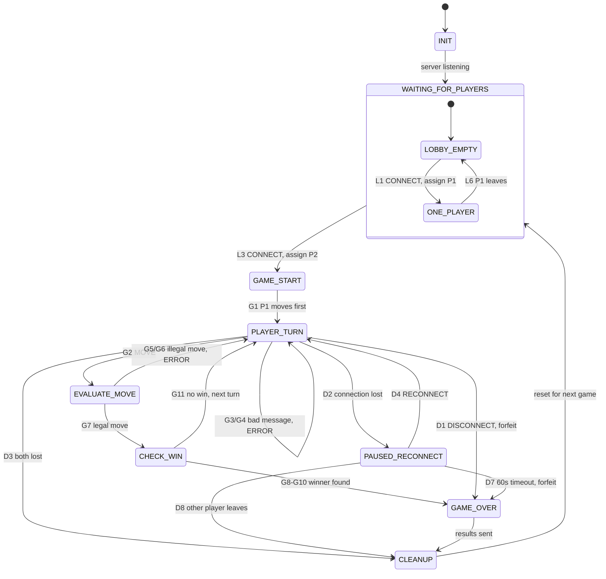

# Pente Server Game State Machine (FSM) Specification

**Project:** CS 457 Term Project: Networked Pente
**Author:** Bode Kaanta
**Sprint:** 1 (Application Protocol & FSM Design)
**Related docs:** [`protocol_blueprint.md`](protocol_blueprint.md) (message schemas and error codes) · [`ai_prompts.md`](ai_prompts.md)

The game is played entirely in the **terminal**: clients print the board as text and read moves as typed input. The server holds **one** game room with exactly one FSM instance. The FSM is the only component allowed to mutate game state. Socket handler threads translate network events into FSM **events** and call `fsm.dispatch(event)` while holding a single `threading.Lock`, so transitions are atomic.

---

## 1. State Transition Diagram



Each arrow is labeled with its row ID from the transition tables in §3 (e.g. **G5/G6** = rows G5 and G6). The tables hold the full guard and action details, so the diagram stays readable. Self-loops that only send an `ERROR` and leave the state unchanged (L2, L4, L5, L7, D5, D6) are listed in the tables only.

---

## 2. State Definitions

| State | Description | Entry actions | Exit to |
|---|---|---|---|
| `INIT` | Server process starting | Load config (`PORT=5457`, `GRACE_PERIOD_SEC=60`), create a listening TCP socket (`SO_REUSEADDR`), create the empty `GameState` | `WAITING_FOR_PLAYERS` |
| `WAITING_FOR_PLAYERS` | Lobby; composite state with substates `LOBBY_EMPTY` (0 seated) and `ONE_PLAYER` (P1 seated) | `accept()` new connections, enable TCP keepalive on each | `GAME_START` |
| `GAME_START` | Transient: both seats are filled | Assign roles (**first `CONNECT` = `P1`, moves first; second = `P2`**), generate a `session_token` per player, send each player `GAME_START`, broadcast initial `STATE_UPDATE` | `PLAYER_TURN` |
| `PLAYER_TURN` | Waiting for the active player's `MOVE` | Broadcast `STATE_UPDATE` with `active_player` | `EVALUATE_MOVE`, `GAME_OVER`, `PAUSED_RECONNECT` |
| `EVALUATE_MOVE` | Transient: validate coordinates and apply the move | Bounds and occupancy checks; place stone; resolve captures | `PLAYER_TURN` (rejected), `CHECK_WIN` |
| `CHECK_WIN` | Transient: check win conditions after a legal move (Pente has no draws) | Five-in-a-row scan from the placed stone; capture count ≥ 5; board-full safety check | `PLAYER_TURN`, `GAME_OVER` |
| `PAUSED_RECONNECT` | One player dropped unexpectedly; game frozen for up to 60 s | Send `PLAYER_STATUS DISCONNECTED` and `STATE_UPDATE (PAUSED_RECONNECT)` to the remaining player; start `threading.Timer(60)` | `PLAYER_TURN`, `GAME_OVER`, `CLEANUP` |
| `GAME_OVER` | Result decided | Broadcast final `STATE_UPDATE (FINISHED)` and `GAME_OVER` to every **still-connected** player | `CLEANUP` |
| `CLEANUP` | Release all game resources | Cancel the grace timer; revoke tokens; close every player socket (send failures ignored); reset `GameState` (empty board, `turn_number=0`, captures 0/0) | `WAITING_FOR_PLAYERS` (post-game reset for the next round) |

**Post-game reset:** after every game, including forfeits and abandoned games, the server returns to `WAITING_FOR_PLAYERS` with an empty lobby. Players who want another round reconnect with `CONNECT`. The server process never needs a restart between games.

---

## 3. Transition Table (Event → Guard → Action → Next State)

### 3.1 Lobby

| # | Current state | Event | Guard | Action | Next state |
|---|---|---|---|---|---|
| L1 | `LOBBY_EMPTY` | `CONNECT` | alias valid, version 1 | Seat as P1; send `LOBBY_WAIT` | `ONE_PLAYER` |
| L2 | `LOBBY_EMPTY` | `CONNECT` | alias invalid / version wrong | `ERROR INVALID_ALIAS` / `VERSION_MISMATCH` (fatal); close | `LOBBY_EMPTY` |
| L3 | `ONE_PLAYER` | `CONNECT` (2nd socket) | valid, alias ≠ P1 alias | Seat as P2 | `GAME_START` |
| L4 | `ONE_PLAYER` | `CONNECT` (2nd socket) | alias == P1 alias | `ERROR ALIAS_TAKEN` (fatal); close that socket only | `ONE_PLAYER` |
| L5 | `ONE_PLAYER` | `MOVE` / `RECONNECT` / unknown | — | `ERROR GAME_NOT_ACTIVE` / `INVALID_TOKEN` | `ONE_PLAYER` |
| L6 | `ONE_PLAYER` | `DISCONNECT` or `CONN_LOST` from P1 | — | Free seat, close socket (no game exists, so no forfeit) | `LOBBY_EMPTY` |
| L7 | any game state | `CONNECT` from a 3rd socket | — | `ERROR ROOM_FULL` (fatal); close that socket only | unchanged |

### 3.2 Gameplay

| # | Current state | Event | Guard | Action | Next state |
|---|---|---|---|---|---|
| G1 | `GAME_START` | (automatic) | — | `GAME_START` to each player; `STATE_UPDATE` (turn 0, active P1) | `PLAYER_TURN` |
| G2 | `PLAYER_TURN` | `MOVE` | sender == active player, payload ints | — | `EVALUATE_MOVE` |
| G3 | `PLAYER_TURN` | `MOVE` | sender ≠ active player | `ERROR NOT_YOUR_TURN` to sender | `PLAYER_TURN` |
| G4 | `PLAYER_TURN` | malformed frame / unknown type / missing field / bad types / `player_id` mismatch | — | `ERROR MALFORMED_JSON` / `UNKNOWN_MSG_TYPE` / `MISSING_FIELD` / `INVALID_PAYLOAD` / `PLAYER_ID_MISMATCH` to sender | `PLAYER_TURN` |
| G5 | `EVALUATE_MOVE` | — | row/col outside 0–18 | `ERROR OUT_OF_BOUNDS`; same player keeps turn | `PLAYER_TURN` |
| G6 | `EVALUATE_MOVE` | — | cell occupied | `ERROR CELL_OCCUPIED`; same player keeps turn | `PLAYER_TURN` |
| G7 | `EVALUATE_MOVE` | — | legal | Place stone; remove captured pairs; increment `captures[player]` | `CHECK_WIN` |
| G8 | `CHECK_WIN` | — | ≥5 in a row through the new stone | result `WIN`, reason `FIVE_IN_A_ROW` | `GAME_OVER` |
| G9 | `CHECK_WIN` | — | `captures[player] ≥ 5` | result `WIN`, reason `FIVE_CAPTURES` | `GAME_OVER` |
| G10 | `CHECK_WIN` | — | no empty cells (theoretical) | result `WIN`, reason `BOARD_FULL`: more captured pairs wins; if tied, P2 wins | `GAME_OVER` |
| G11 | `CHECK_WIN` | — | otherwise | `turn_number += 1`; broadcast `STATE_UPDATE` | `PLAYER_TURN` |

### 3.3 Disconnects & Reconnects

| # | Current state | Event | Guard | Action | Next state |
|---|---|---|---|---|---|
| D1 | `PLAYER_TURN` | `DISCONNECT` message from Px | — | Close Px socket; opponent wins: `FORFEIT`, `OPPONENT_QUIT` | `GAME_OVER` |
| D2 | `PLAYER_TURN` | `CONN_LOST` from Px (EOF `b""`, `ConnectionResetError`, `ConnectionAbortedError`, `BrokenPipeError`, keepalive timeout) | opponent still connected | Close Px socket; send `PLAYER_STATUS DISCONNECTED (60)` and `STATE_UPDATE PAUSED_RECONNECT` to the opponent; start the 60 s timer | `PAUSED_RECONNECT` |
| D3 | `PLAYER_TURN` | `CONN_LOST` from both (simultaneous) | no one connected | — | `CLEANUP` |
| D4 | `PAUSED_RECONNECT` | `RECONNECT` (new socket) | alias and token match the paused seat, timer not expired | Cancel timer; bind socket to seat; `GAME_START (resumed:true)` to the rejoiner; `PLAYER_STATUS RECONNECTED` to the opponent; broadcast `STATE_UPDATE ACTIVE` | `PLAYER_TURN` (same `active_player` as before the drop) |
| D5 | `PAUSED_RECONNECT` | `RECONNECT` | bad alias or token | `ERROR INVALID_TOKEN` (fatal); close **that** socket only | `PAUSED_RECONNECT` |
| D6 | `PAUSED_RECONNECT` | `MOVE` from remaining player | — | `ERROR GAME_NOT_ACTIVE` | `PAUSED_RECONNECT` |
| D7 | `PAUSED_RECONNECT` | `GRACE_TIMEOUT` (timer fires) | — | Remaining player wins: `FORFEIT`, `OPPONENT_TIMEOUT` | `GAME_OVER` |
| D8 | `PAUSED_RECONNECT` | `DISCONNECT` or `CONN_LOST` from the remaining player | — | Both gone → game abandoned; nobody to notify | `CLEANUP` |
| D9 | `GAME_OVER` / `CLEANUP` | any `CONN_LOST` / send failure | — | Ignore (sockets are being closed anyway) | unchanged |

**Why the two kinds of disconnect are treated differently:** a `DISCONNECT` message is an explicit decision to quit, so it forfeits immediately. EOF, RST, and timeouts may be accidental (crash, cable pull, CML link cut), so the player gets a 60 s window to rejoin. See `protocol_blueprint.md` §5.

**Transient states and concurrency:** `GAME_START`, `EVALUATE_MOVE`, and `CHECK_WIN` execute synchronously inside one `dispatch()` call under the FSM lock. A disconnect detected by another thread during that time waits on the lock and is processed afterward, from `PLAYER_TURN` (or `GAME_OVER`).

---

## 4. Pente Rule Logic Used in `EVALUATE_MOVE` / `CHECK_WIN`

**Notation:** `(row, col)` is a board position. `row` counts down from 0 (top) to 18 (bottom), and `col` counts across from 0 (left) to 18 (right). A **direction** is a step `(row_step, col_step)` where each part is -1, 0 or +1. For example, `(0, +1)` means "one to the right" and `(-1, +1)` means "one up and to the right." There are 8 directions in total: up, down, left, right, and the 4 diagonals.

- **Board:** 19×19 grid. Each cell is `"."` (empty), `"1"` (P1 stone) or `"2"` (P2 stone).
- **Turn order:** `active_player = "P1" if turn_number % 2 == 0 else "P2"`. P1 always moves first.
- **Placement:** one stone per turn on any empty intersection.
- **Capture:** after a stone is placed at `(row, col)`, the server looks outward in each of the 8 directions. If the **next two** cells in that direction hold **opponent** stones and the **third** cell holds the **mover's own** stone (pattern `X O O X`), the two opponent stones are removed and the mover's capture count goes up by 1.
  - *Example:* P1 places at `(9, 10)`. Looking right, `(0, +1)`: `(9, 11)` = `2`, `(9, 12)` = `2`, `(9, 13)` = `1`. The P2 stones at `(9, 11)` and `(9, 12)` are captured.
  - Only exactly **two** stones are captured, never one or three.
  - Placing your own stone **into** the middle of `X _ _ X` is safe. A capture only happens on the move that *closes* the pattern.
- **Win, five in a row:** the mover has 5 or more of their stones in a straight line (horizontal, vertical, or diagonal) that includes the stone just placed.
- **Win, five captures:** the mover has captured 5 pairs (10 stones).
- **Order of checks:** resolve captures first, then five-in-a-row, then capture count.
- **No draws:** Pente has no draw. As a safety net for the theoretical case where all 361 cells fill with no winner, the player with more captured pairs wins. If captures are tied, P2 wins, since P1 had the first-move advantage (G10).

---

## 5. Server Data Model (owned by the FSM)

```python
@dataclass
class Seat:
    player_id: str            # "P1" / "P2"
    alias: str
    sock: socket.socket | None  # None while disconnected
    session_token: str
    connected: bool

@dataclass
class GameState:
    state: str = "INIT"       # one of the FSM states above
    board: list[list[str]] = field(default_factory=lambda: [["."] * 19 for _ in range(19)])
    turn_number: int = 0
    captures: dict = field(default_factory=lambda: {"P1": 0, "P2": 0})
    seats: dict = field(default_factory=dict)   # "P1"/"P2" -> Seat
    last_move: dict | None = None
    paused_player: str | None = None
    grace_timer: threading.Timer | None = None
```

---

## 6. Edge-Case Checklist

| Edge case | Handled by |
|---|---|
| Out-of-turn move | G3: `ERROR NOT_YOUR_TURN`; state unchanged |
| Invalid coordinates / occupied cell | G5, G6: `ERROR`; same player retries |
| Malformed JSON / wrong types / unknown `msg_type` | G4: `ERROR`; receive loop keeps running |
| Client spoofs the other player's `player_id` | G4: `PLAYER_ID_MISMATCH` (identity comes from the socket) |
| Graceful quit mid-game | D1: immediate forfeit |
| Crash / `kill -9` / cable pull mid-game | D2 → D4 (rejoin) or D7 (forfeit after 60 s) |
| Both players drop | D3 / D8: `CLEANUP` |
| Player 1 leaves the lobby before Player 2 arrives | L6: seat freed, no game created |
| Third client connects | L7: `ROOM_FULL` |
| Wrong token on reconnect | D5: rejected; the paused game keeps waiting |
| Next round after a game ends | `CLEANUP` → `WAITING_FOR_PLAYERS` |
